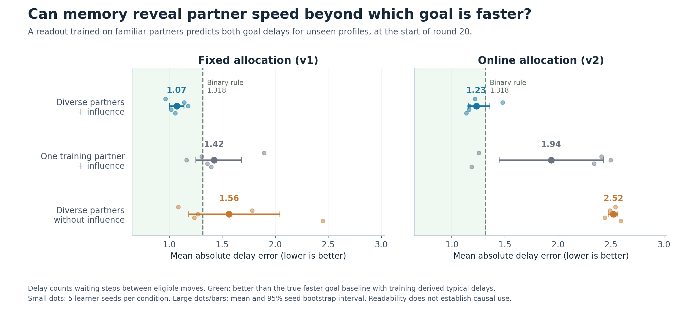
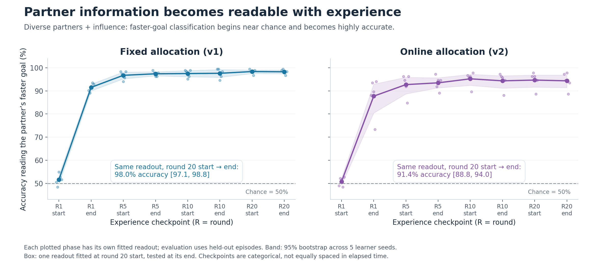
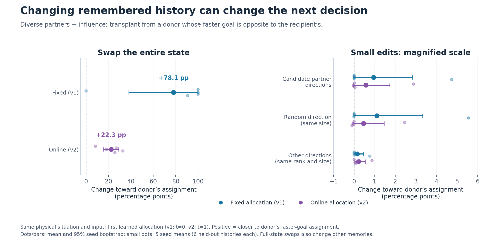
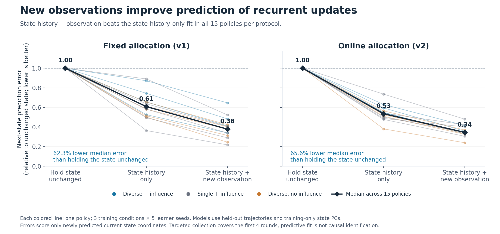

# Interpretable findings

Generated from completed analysis summaries, without rerunning or refitting models. Each PNG has a vector PDF and its plotted values in CSV.

1. **Partner speed:** the diverse + influence fixed-allocation policies improve novel-profile delay prediction beyond an oracle faster-goal baseline; online evidence is weaker.
2. **Experience:** faster-goal information is initially near chance, then readable across phases in the diverse + influence condition.
3. **Decisions:** whole-state swaps change allocations; candidate partner edits are small and exploratory. The panels use different horizontal scales.
4. **Dynamics:** adding observation input improves next-state prediction in all 30 policies, within the early four-round capture.

Bootstrap intervals have only five learner seeds per condition. Subspace validation is limited; no selective partner-memory claim follows. See the parent report for coverage, controls and limitations.









Reproduce from the repository root with the experiment Python:

```bash
python -m eval.partner_dynamics.plot_findings --results /juice6/u/jshe/emergent_partner_grid/eval/partner_dynamics/results/counterbalanced1096_20261002_235609
```
