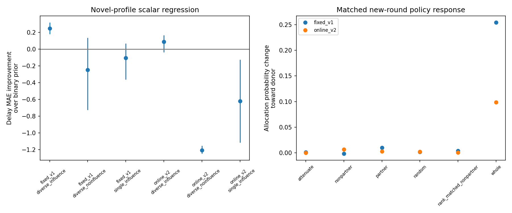

# Partner representations and recurrent dynamics

Primary batch: `counterbalanced1096_20261002_235609`. Protocols, conditions and learner seeds are analyzed independently; no hidden coordinates are pooled.

## Raw-state geometry and transfer

Primary capability regression uses the raw post-observation state at round 20 start. MAE is compared with a training-derived capability prior conditional on the true faster-goal identity. Positive improvement means information beyond that binary label helps prediction. This is a representational diagnostic, not evidence of causal use.

| Protocol | Condition | Evaluation | Delay MAE | Binary prior MAE | Improvement (95% seed bootstrap) |
| --- | --- | --- | ---: | ---: | ---: |
| fixed_v1 | rnn_diverse_influence | familiar_to_novel | 1.071 | 1.318 | 0.247 [0.180, 0.317] |
| fixed_v1 | rnn_diverse_influence | target_layout | 1.000 | 1.175 | 0.174 [0.132, 0.222] |
| fixed_v1 | rnn_diverse_influence | within_profile | 1.031 | 1.214 | 0.182 [0.150, 0.215] |
| fixed_v1 | rnn_diverse_noinfluence | familiar_to_novel | 1.565 | 1.318 | -0.247 [-0.725, 0.135] |
| fixed_v1 | rnn_diverse_noinfluence | target_layout | 1.447 | 1.175 | -0.273 [-0.789, 0.123] |
| fixed_v1 | rnn_diverse_noinfluence | within_profile | 1.447 | 1.214 | -0.233 [-0.763, 0.187] |
| fixed_v1 | rnn_single_influence | familiar_to_novel | 1.424 | 1.318 | -0.106 [-0.363, 0.068] |
| fixed_v1 | rnn_single_influence | target_layout | 1.002 | 1.175 | 0.173 [0.129, 0.221] |
| fixed_v1 | rnn_single_influence | within_profile | 1.026 | 1.214 | 0.188 [0.141, 0.232] |
| online_v2 | rnn_diverse_influence | familiar_to_novel | 1.232 | 1.318 | 0.087 [-0.039, 0.166] |
| online_v2 | rnn_diverse_influence | target_layout | 1.117 | 1.175 | 0.058 [-0.187, 0.203] |
| online_v2 | rnn_diverse_influence | within_profile | 1.091 | 1.214 | 0.123 [-0.044, 0.240] |
| online_v2 | rnn_diverse_noinfluence | familiar_to_novel | 2.523 | 1.318 | -1.204 [-1.246, -1.153] |
| online_v2 | rnn_diverse_noinfluence | target_layout | 2.586 | 1.175 | -1.411 [-1.461, -1.363] |
| online_v2 | rnn_diverse_noinfluence | within_profile | 2.551 | 1.214 | -1.338 [-1.365, -1.314] |
| online_v2 | rnn_single_influence | familiar_to_novel | 1.937 | 1.318 | -0.619 [-1.113, -0.126] |
| online_v2 | rnn_single_influence | target_layout | 1.857 | 1.175 | -0.682 [-1.283, -0.036] |
| online_v2 | rnn_single_influence | within_profile | 1.802 | 1.214 | -0.589 [-1.141, -0.037] |

## Collection, dynamics and interventions

30 policies have completed targeted capture and replay checks.

### fixed_v1

{
  "status": "completed",
  "policies": 15,
  "median_test_improvement_over_persistence": 0.6225604449812316,
  "limitations": [
    "InputDSA uses pinned official DMDc/controllability components with explicit safe transition pairing.",
    "Unmodified upstream list concatenation would create cross-trajectory transitions; adapter corrects this boundary assembly.",
    "Native distance ordering is joint/state/control; exported fields are named explicitly.",
    "Regime matrices reflect the same nonlinear weights visited in different states.",
    "Common raw input projection is a fixed lossy basis; inspect its held-out prediction error before cross-policy comparisons.",
    "Only the prespecified early four-round diagnostic capture is fitted; full late-episode input dynamics require additional collection.",
    "Bootstrap of paired recipients is shown per policy; effects must also be compared across learner seeds."
  ]
}

### online_v2

{
  "status": "completed",
  "policies": 15,
  "median_test_improvement_over_persistence": 0.6555309277788094,
  "limitations": [
    "InputDSA uses pinned official DMDc/controllability components with explicit safe transition pairing.",
    "Unmodified upstream list concatenation would create cross-trajectory transitions; adapter corrects this boundary assembly.",
    "Native distance ordering is joint/state/control; exported fields are named explicitly.",
    "Regime matrices reflect the same nonlinear weights visited in different states.",
    "Common raw input projection is a fixed lossy basis; inspect its held-out prediction error before cross-policy comparisons.",
    "Only the prespecified early four-round diagnostic capture is fitted; full late-episode input dynamics require additional collection.",
    "Bootstrap of paired recipients is shown per policy; effects must also be compared across learner seeds."
  ]
}

## Interpretation and limits

Decodability, representational geometry, fitted dynamics and behavioral interventions answer different questions. A positive decoder improvement does not establish that the policy estimated an unobserved delay; correlated population priors and task state remain alternatives.

All 20 episode rounds are audited with terminal-inclusive masks. Geometry uses equal numbers of raw start/midpoint/end samples per episode. Recorded raw trajectories remain intact in the historical HDF5 files. Timesteps are never independent statistical replicates.

Target-layout tests hold out the sampled target layouts from analysis fitting; earlier histories can overlap them. These tests do not measure policy generalization to layouts absent from policy training.

Sparse profile-by-layout crossing is handled with train/validation/test multivariate regression instead of filling missing dPCA cells. Layout conditioning uses recorded geometry and phase, not unrecorded full current observations.

RDM scores use training-only diagonal shrinkage and disjoint repetition halves. Their pairwise correlations are descriptive because profile pairs are dependent. Capability/relative/overall models are correlated and are not uniquely disentangled.

The static corpus audit is a baseline: all authoritative profiles favor giving the partner its faster goal. That formula does not simulate collisions or online switches.

Each policy directory contains numeric tables, event trajectories, PCA/novel geometry, representational models, cross-temporal transfer and variance figures. Consult `data_audit.json`, split manifests and per-file validation for coverage and provenance.

## Reproduction

See the source package README and `methods.md` for exact commands and runtime settings.

## Quantitative findings and causal limits

Coverage: **30 recurrent policies, 27,600 historical episodes and 20,041,530 valid historical steps**. Geometry uses 1,656,000 raw event states. The separate collector adds 720 four-round histories (113,475 valid steps), 9,360 paired branches including zero controls, and 180 local derivative samples.

Original full-network replay has maximum checked hidden/probability/value error 0; sampled actions agree exactly. All zero-magnitude checks pass: True. Identical-input first learned allocation probabilities also match the paired physical branches exactly. For v2, the comparison is at t=1 following its forced t=0 action.

| Protocol | Median reduction in current-state MSE versus persistence | Driven fit beats input-omitting baseline |
| --- | ---: | ---: |
| fixed_v1 | 62.3% | 15/15 policies |
| online_v2 | 65.6% | 15/15 policies |

These fits predict the newly updated state, excluding already observed lag blocks from the validation score. They support a useful local/global approximation in the sampled early histories. A fitted mode is not a belief axis; weights are fixed across partner regimes. Full late-episode driven dynamics were not measured.

### Input-matched allocation effects

Opposite-orientation donor effects below are signed **toward the donor’s faster-goal assignment**, so red/blue directions do not cancel. Each value averages the six held-out recipient histories within each seed, then averages seeds. Full results retain each condition, control, recipient and same-orientation donor.

| Protocol | Perturbation | Toward-donor probability change | Paired reward change | First learned flat-policy L1 change |
| --- | --- | ---: | ---: | ---: |
| fixed_v1 | attenuate | +0.0012 | -0.0214 | 0.0153 |
| fixed_v1 | nonpartner | -0.0016 | -0.0368 | 0.0150 |
| fixed_v1 | partner | +0.0099 | -0.0438 | 0.0249 |
| fixed_v1 | random | +0.0019 | -0.0128 | 0.0224 |
| fixed_v1 | rank_matched_nonpartner | +0.0039 | +0.0150 | 0.0154 |
| fixed_v1 | whole | +0.2543 | -0.0391 | 0.7406 |
| online_v2 | attenuate | +0.0000 | +0.0138 | 0.0662 |
| online_v2 | nonpartner | +0.0067 | -0.0156 | 0.0849 |
| online_v2 | partner | +0.0031 | +0.0022 | 0.0811 |
| online_v2 | random | +0.0021 | +0.0054 | 0.0761 |
| online_v2 | rank_matched_nonpartner | +0.0008 | -0.0501 | 0.0768 |
| online_v2 | whole | +0.0984 | +0.0936 | 0.8746 |

**11/30 candidate subspaces scored at or below chance on the six-history binary validation check.** These policies remain included and their subspace interventions are exploratory. Even above chance, six validation histories provide weak subspace validation.

Whole-carry effects show that earlier history can change the same input’s policy response. They can also change nuisance memories. Small candidate-subspace effects and matched-control effects do not establish selective partner-memory use. Norm sweeps, sham donors, single-direction controls and explicit rank-matched complement projectors are retained. Same-orientation/different-delay donors test effects beyond a binary reversal; their outcomes appear separately in `intervention_aggregate.json`.

See `selectivity_contrasts.json` for paired partner-minus-rank-control effects across all learner seeds. No unsuccessful policy or failed candidate subspace was dropped.

Exact derivatives under identical input are saved in `input_matched_sensitivity_summary.csv`: natural history changes the local input response and can change policy/value sensitivities. Same-profile donors provide a nuisance-memory comparison. The v2 t=0 action mask makes policy allocation derivatives zero there; its first learned response is assessed by the t=1 replay.

Exact local derivatives: median hidden Jacobian singular-value gain 2.694, median spectral radius 1.039. Pointwise gains and eigenvalues are reported with finite-horizon products; neither establishes an attractor of the policy–environment loop.

### Figure and table guide

- `geometry.png`: raw round-start PCA trajectories and held-out representational-model scores. `event_trajectories.csv` supplies coordinates and counts; `rdms.npz` supplies diagonal-noise-normalized and Euclidean/correlation matrices.
- `cross_temporal_transfer.png`: faster-goal directions fitted at one phase and evaluated on different phases in disjoint episodes. `cross_temporal_accuracy.csv` gives the full matrix; initial-round chance performance and late-phase transfer are distinct.
- `novel_profile_geometry.png`: familiar-training PCA coordinates applied to held-out familiar/novel profiles. `novel_geometry.csv` gives high-dimensional residual/support diagnostics; plotted positions alone do not establish extrapolation.
- `factor_conditioned_variance.png`: held-out variance of train-only hidden PCs explained by phase/layout, binary, capability and interaction models. This regression is the stated alternative to unsupported fully crossed dPCA.
- `event_aligned_updates.png`: update norms aligned to observable movement and real allocation events. `movement_exposure.json` reports which goal speeds were actually observed and cadence intervals.
- `dynamics_and_interventions.png`: predictive validity versus persistence/input baselines and paired reward magnitude sweeps. Use `open_loop_outcomes.json` for the first learned decision, especially v2.

### Remaining limits

The targeted design uses only six profiles, one held-out history per profile per seed, and four rounds. It has limited power for selective effects and does not match total step exposure across capabilities. Candidate directions may mix partner and nuisance memory; validation failures are negative results, not evidence that memory is absent.

Within-orientation geometry and prediction beyond the binary prior support information beyond a single faster-goal label in some conditions. They do not prove that an unobserved delay was estimated from evidence or that the extra information is used for reward. Check the observable movement strata and population-prior baseline.

The optional fixed/slow-point phase and archived greedy replication were not run. Full late-episode encoded-input fits and fully history-disjoint layout transfer require a larger targeted collection.
